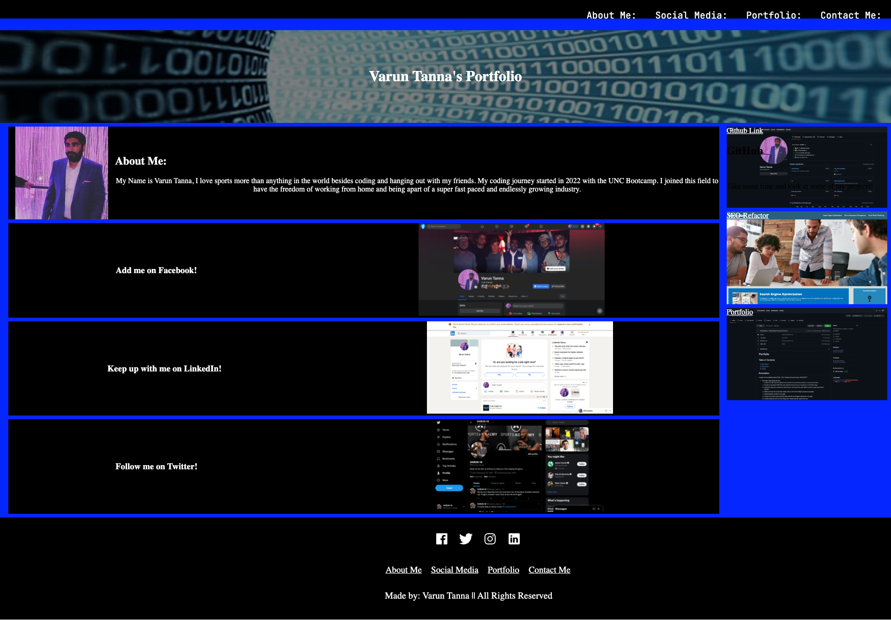

# Portfolio

## Table of Contents
1. [Description](#discription)
2. [Respository](#respository)
3. [Visuals](#visuals)

## Description
I made my first website using HTML, CSS, Felxbox and even some JAVASCRIPT! 

- The steps I took along the way:
    1. Copied the SSH key from github and cloned it in my terminal inside our homeworks folder.
    2. Created a standard HTML flie and make the boxed strucre I wanted for my Porfolio Page.
    3. Added Div after Div and Section after Secion and used links with HREF to get the page layout that I wanted.
    4. Made sure that all my sections break down in View Port Height as best as possible.
    5. Started adding content to my page
    6. Linked my css and reset css flies along with all the images I wanted for my page.
    7. Created class and id's for the things that I would need to style in the css.
    8. styled the css as best as I could to try and add some life to this page.
    9. Linked all of my websites and added some anchor to make my picutres go to my Social Media pages.
    10. Finshed my Read me, set it up with the format as my last project.

## Respository 

- [Respository](https://github.com/VarunTanna/Portfolio)

- [LIVE SITE](https://varuntanna.github.io/Portfolio/)

## Visuals

